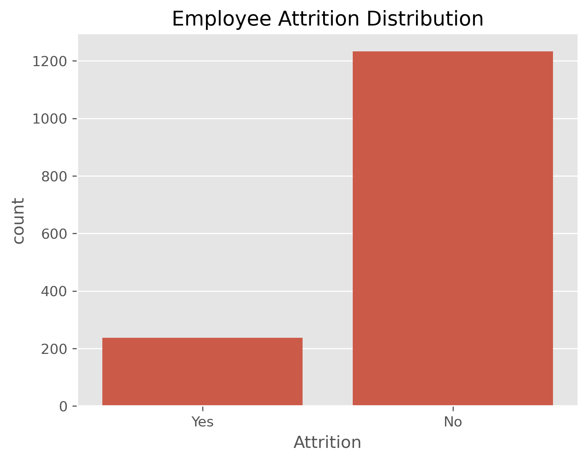
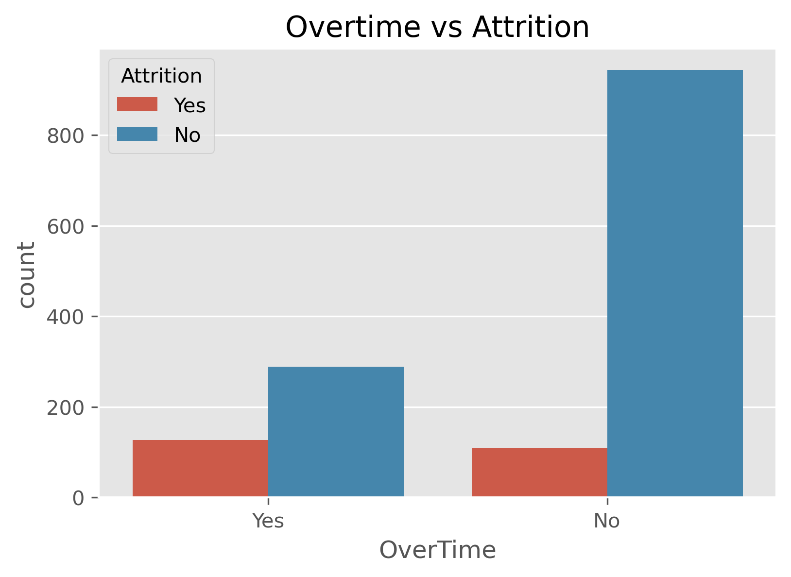
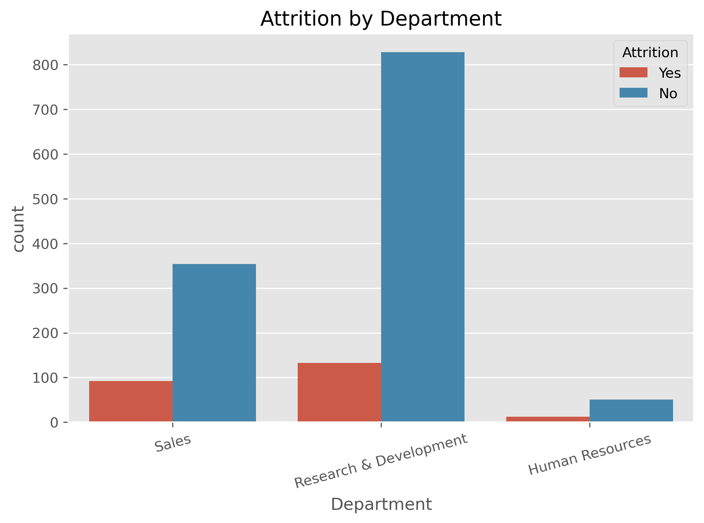
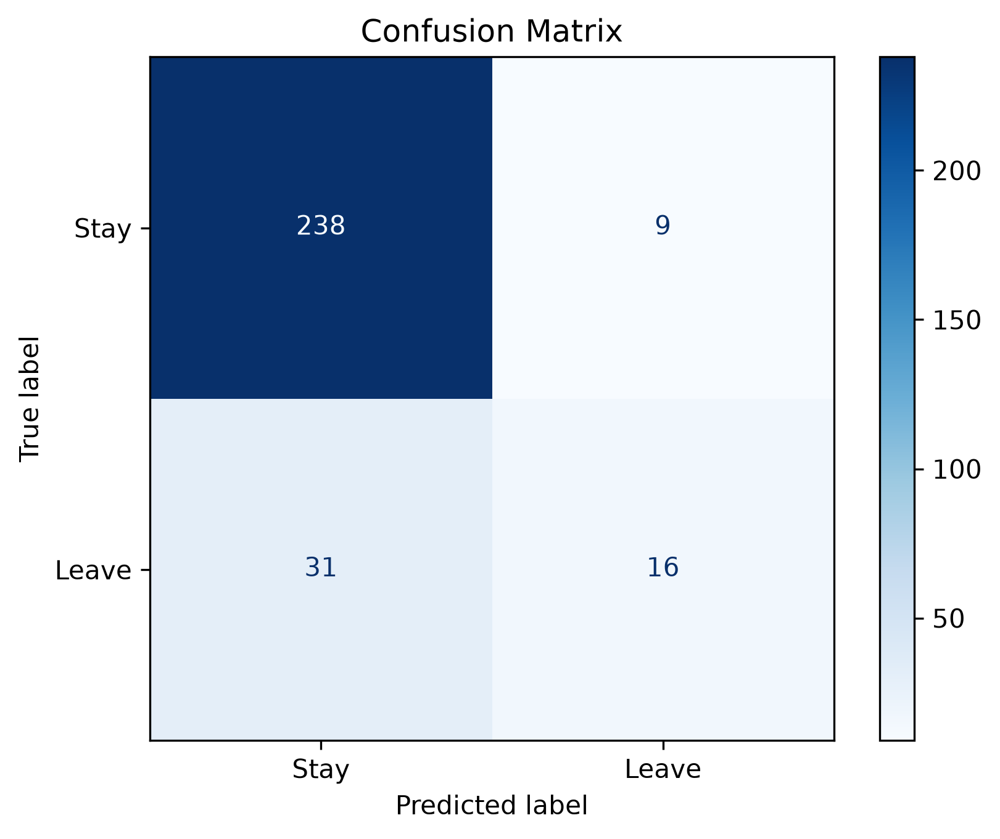
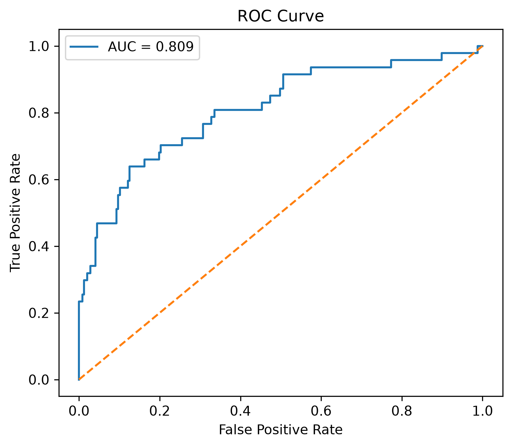
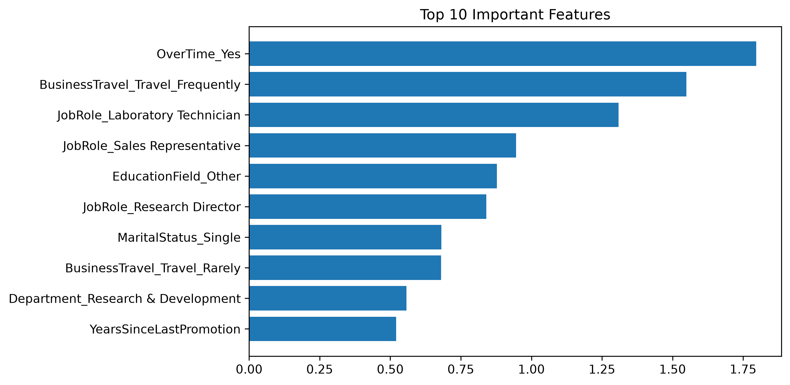

# 📊 Employee Attrition Prediction

A Machine Learning project that predicts whether an employee is likely to leave an organization based on employee-related information.

The project includes data preprocessing, exploratory data analysis, machine learning model training, evaluation, and an interactive Streamlit application.

---

## 🚀 Project Overview

Employee attrition can affect organizations through increased recruitment costs, productivity loss, and employee replacement efforts.

This project uses historical HR data to build a classification model that predicts employee attrition.

The final application allows users to enter employee details and receive an attrition prediction with a probability score.

---

## 🎯 Objectives

* Analyze employee HR data.
* Identify patterns related to employee attrition.
* Perform data cleaning and preprocessing.
* Train multiple machine learning classification models.
* Compare model performance.
* Evaluate the selected model using multiple metrics.
* Build an interactive prediction application using Streamlit.

---

## 🛠️ Tech Stack

### Programming Language

* Python

### Data Analysis

* Pandas
* NumPy

### Data Visualization

* Matplotlib
* Seaborn

### Machine Learning

* Scikit-learn
* Logistic Regression
* Decision Tree
* Random Forest

### Application

* Streamlit

### Development Tools

* Jupyter Notebook
* VS Code
* Git
* GitHub

---

## 📁 Project Structure

```text
Employee-Attrition-Prediction/
│
├── app/
│   └── app.py
│
├── data/
|    └──WA_Fn-UseC_-HR-Employee-Attrition.csv
│
├── images/
│   ├── confusion_matrix.png
│   ├── roc_curve.png
│   └── feature_importance.png
│
├── models/
│   ├── attrition_model.pkl
│   └── scaler.pkl
│
├── notebooks/
│   └── eda.ipynb
│
├── reports/
│   ├── classification_report.txt
│   └── model_metrics.csv
│
├── src/
│   ├── preprocess.py
│   ├── train_model.py
│   └── evaluate_model.py
│
├── requirements.txt
├── README.md
└── .gitignore
```

---

## 🔄 Machine Learning Workflow

```text
Raw HR Dataset
      ↓
Data Cleaning
      ↓
Exploratory Data Analysis
      ↓
Feature Engineering
      ↓
Categorical Encoding
      ↓
Train/Test Split
      ↓
Feature Scaling
      ↓
Model Training
      ↓
Model Comparison
      ↓
Model Evaluation
      ↓
Saved ML Model
      ↓
Streamlit Application
```

---

## 📊 Exploratory Data Analysis

The project analyzes several factors that may be associated with employee attrition, including:

* Age
* Monthly Income
* Department
* Job Role
* Overtime
* Job Satisfaction
* Years at Company
* Distance From Home

### Attrition Distribution



### Overtime vs Attrition



### Department vs Attrition



---

## 🤖 Machine Learning Models

Three classification algorithms were trained and compared:

### 1. Logistic Regression

Used as a baseline classification model.

### 2. Decision Tree

A tree-based model that makes predictions using decision rules.

### 3. Random Forest

An ensemble model that combines multiple decision trees.

The models were compared using their performance on the test dataset.

---

## 📈 Model Evaluation

The selected model was evaluated using:

* Accuracy
* Precision
* Recall
* F1 Score
* ROC-AUC
* Confusion Matrix

### Confusion Matrix



### ROC Curve



### Feature Importance



---

## 🌐 Streamlit Application

The project includes an interactive Streamlit application.

Users can enter employee information such as:

* Age
* Monthly Income
* Distance From Home
* Years at Company
* Job Level
* Job Satisfaction
* Overtime
* Gender
* Department
* Marital Status

The application then provides:

* Predicted attrition class
* Probability of employee attrition

---

## ▶️ How to Run the Project

### 1. Clone the repository

```bash
git clone YOUR_GITHUB_REPOSITORY_URL
```

### 2. Open the project

```bash
cd Employee-Attrition-Prediction
```

### 3. Create a virtual environment

```bash
python -m venv venv
```

### 4. Activate the environment

Windows PowerShell:

```powershell
.\venv\Scripts\Activate.ps1
```

### 5. Install dependencies

```bash
pip install -r requirements.txt
```

### 6. Run preprocessing

```bash
python src/preprocess.py
```

### 7. Train the models

```bash
python src/train_model.py
```

### 8. Evaluate the model

```bash
python src/evaluate_model.py
```

### 9. Run the Streamlit application

```bash
streamlit run app/app.py
```

---

## 📌 Project Status

🚧 **In Progress**

Current features include:

* [x] Data preprocessing
* [x] Exploratory Data Analysis
* [x] Model training
* [x] Model comparison
* [x] Model evaluation
* [x] Feature importance analysis
* [x] Streamlit prediction application

Future improvements may include:

* [ ] Model hyperparameter tuning
* [ ] Improved dashboard visualizations
* [ ] Model monitoring
* [ ] Cloud deployment

---

## ⚠️ Disclaimer

This project is intended for educational and portfolio purposes.

Employee attrition predictions should not be treated as definitive decisions about individual employees. Predictions from a machine learning model can contain errors and should be interpreted in context.

---

## 👩‍💻 Author

**Sonali Kumari**

B.Tech CSE (Data Science)

---

## ⭐ If you find this project useful

Feel free to explore the code, experiment with the models, and improve the application.
